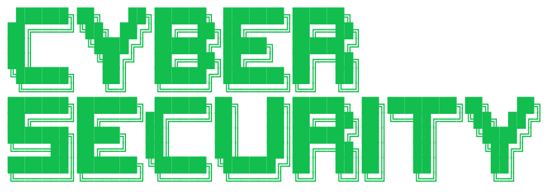
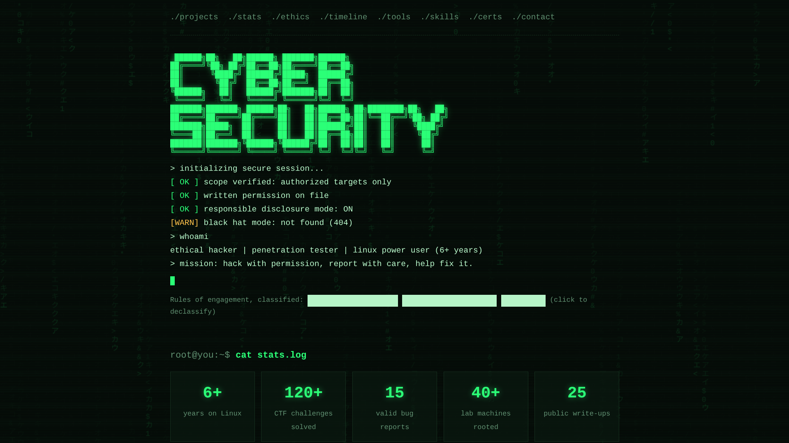
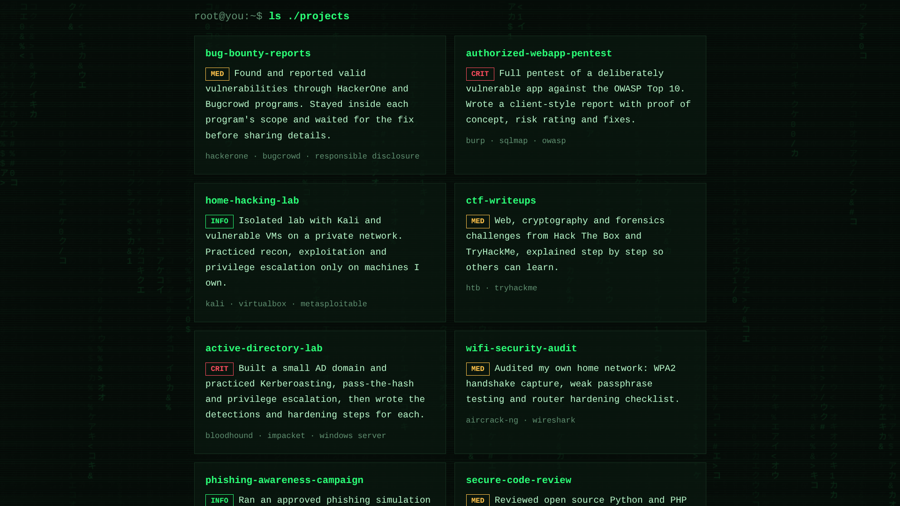
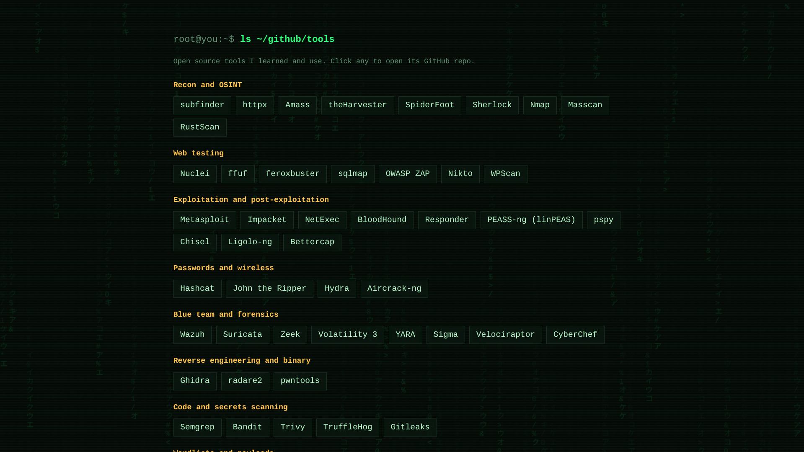
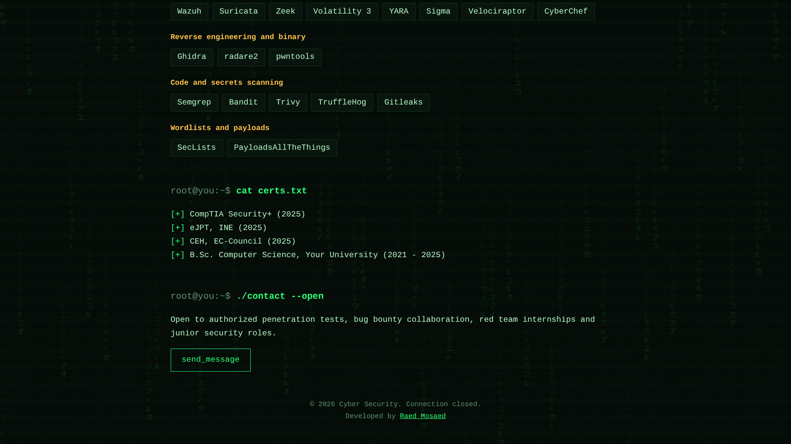

  

 

# 🛡️ Cybersecurity Portfolio

A modern **Cybersecurity Portfolio Website** with a terminal-inspired interface, futuristic visuals, and a security-focused design.

**Skills • Projects • Tools • Certifications • Experience**

## ✨ Overview

A modern **Cybersecurity Portfolio Website** designed to present a cybersecurity profile in a visually engaging and professional way.

The website combines a **terminal-style interface**, Matrix-inspired visuals, interactive elements, smooth animations, and a dark security-focused aesthetic.

### 🔎 What It Includes

| Section           | Description                                  |
| ----------------- | -------------------------------------------- |
| 👤 Profile        | Personal & professional information          |
| 🛡️ Skills        | Cybersecurity skills and technical knowledge |
| 🧪 Projects       | Security-related projects and work           |
| 🛠️ Tools         | Tools and technologies                       |
| 📊 Statistics     | Skills and portfolio statistics              |
| 📜 Certifications | Certifications and achievements              |
| 📅 Experience     | Experience and learning journey              |
| 🔐 Security       | Ethical hacking & cybersecurity content      |
| 📫 Contact        | Social and contact information               |

---

## 🎨 Design

The website is built around a dark **cybersecurity / terminal aesthetic** inspired by:

* Linux Terminals
* Command-Line Interfaces
* Matrix-style visuals
* Security Dashboards
* Hacker-inspired UI

The visual identity uses:

**Dark backgrounds · Green accents · Monospace typography · Terminal elements · Glow effects · Smooth animations**

## ⚙️ Tech Stack

* HTML5
* CSS3
* JavaScript
* Canvas API
* CSS Animations
* Responsive Design

## 📱 Responsive Design

The portfolio is designed to adapt across different screen sizes:

**Desktop · Laptop · Tablet · Mobile**

## 🖼️ Website Preview

  
  

  
  

## 🌐 Live Demo

---

## </> Developer

**Developed by Raed Mosaed**

---

© 2026 **Raed Mosaed**
